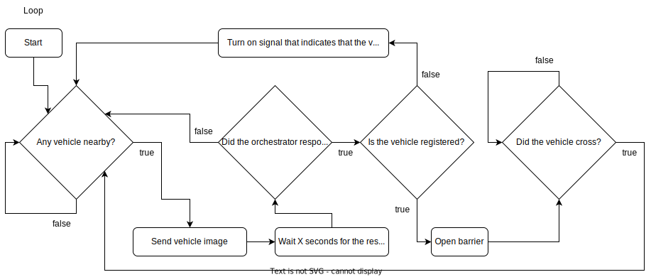

# Table of Contents <!-- omit in toc -->

- [Sobre o projeto](#sobre-o-projeto)
- [Código fonte](#código-fonte)
  - [Sensores simulados](#sensores-simulados)

# Serviço para Estacionamentos Inteligentes (SEI) - Edge Layer <!-- omit in toc -->

# Sobre o projeto

# Código fonte

Explicar o que cada diagrama significa. Setup e Loop.

  

  

## Sensores simulados

Câmera.
